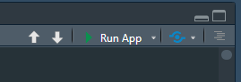

# EpitoScope
Shiny App for visualization of immunopeptidomics data

## Features
- Interactive visualization of immunopeptidomics datasets.
- Support for:
  - PEAKS X Pro peptide.csv
  - PEAKS 12 Studio psm.csv
  - PEAKS 12 Online psm.csv
  - PEAKS 13 Studio psm.csv
  - FragPipe psm.tsv
  - FragPipe peptide.tsv
  - FragPipe combined_peptide.tsv
  - FragPipe combined_(modified)_peptide.tsv
- Customizable plots and tables.

## Installation
The following 3 scripts are mandatory to run the shiny App:
- Shiny.R
- global.R
- ui.R
- (report.Rmd for creating a report currently doesnt work)
Download the 3 scripts manually to the same folder or clone the repository using Git. For this, ensure Git is installed on your system. If not, download and install it from [Git's official website](https://git-scm.com/). Then, run the following command in your terminal:

```bash
git clone https://github.com/your-repo/EpitoScope.git
```

This will download all necessary files into a folder named `EpitoScope`.

## Usage
1. Open Shiny.R with Rstudio
2. install missing dependencies (automatic popup in Rstudio).
3. Some remaining dependencies have to be installed via BiocManager:
```R
BiocManager::install("clusterProfiler")
BiocManager::install("org.Hs.eg.db")
```
4. Load your data as namend list into the variable (see data_loading.R for more details.):
```R
preloaded_data
```
5. In Shiny.R the "Run" button will be replaced by the "Run App" button. Click it and the app will start in a separate window.

