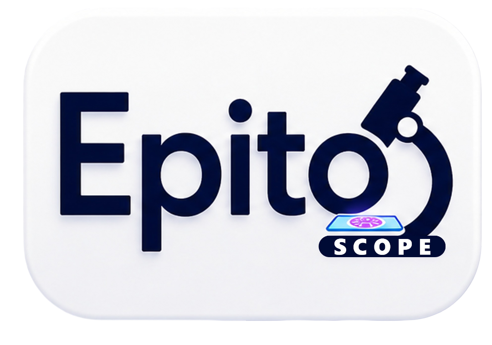
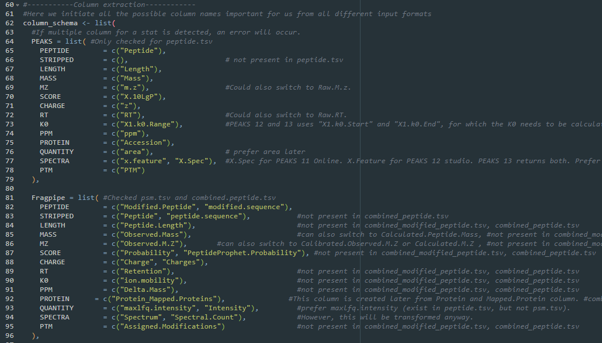
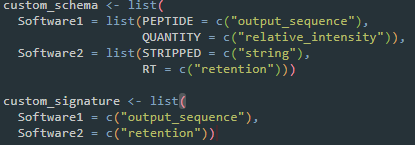
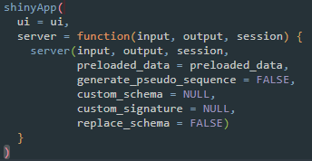

# EpitoScope
Shiny App for visualization of immunopeptidomics data



## WIP
Task List
- [X] Create Error Handler
- [X] Implement netMHCpan calling using WSL on windows
- [X] Allow Custom Schema
- [X] Combine the unique and lookup table, to one unified table
- [X] Accept an anotation table to better differentiate measurements into biological/technical replicate and condition. This allows fine tuned handling of conditions within the same input data.
- [X] Overhaul the HTML report and update the report generation function.
- [X] Make Sequence motif (stretches too much for only 1 sample) and measurement specific heatmap plots format better.
- [ ] clearly separate, and if needed add option, between peptide and peptidoform plots.
- [X] Solve the automatic ordering of categorical data by ggplot.
- [X] Prevent filtering criteria reset when selecting/deselecting samples. Likewise the groups for the grouped analysis.
- [X] Change functions to pkg::fun() style (i.e. dplyr::mutate()). This avoids future function masking.
- [X] ~Decouple data calculations and plotting function, so that when changing window size only the plotting function is rerun and not the whole calculation~. Switch to plotly, which automates this
- [X] Have a better way to separate PROTEIN names for different input formats.
- [ ] How to do NA handling for PCA plot. Sometimes user-input data is biologically too different for imputation.
- [X] Unify PTM nomenclature between output. Translate mass difference to PTM.
- [ ] Double check netmHCpan precomputed data, if it indeed analysed all possible peptides.
- [ ] Make the precomputed data more efficient. Parquet for reading and merge the different length together, by using the first # letters for each max_length peptide as the #mer peptide.
- [X] Limit HLA allele for binding prediction, so the plots and stats only incorporate relevant HLA and not everything.
- [X] MHC prediction supports all alleles that netMHCpan supports, but visualization only uses "HLA" prefix to find the necessary columns.
- [X] Support netMHCpan calling for linux and mac.
- [X] Add option of different binding prediction binder threshold (e.g. for HLA2)
- [X] Add more plots to binding prediction to better mimic MhcVizPip
- [X] Decide on how to download the binding Data.
- [ ] GO-term more transparency on protein names used
- [ ] Solve the usage of Peptide and Peptidoform usage in group analysis
- [X] ~STRING allow background~ STRING is only used for interaction which is not affected by background. Instead, background option is in GO-term analysis
- [ ] Document each function
- [ ] Convert to Package
- [ ] Ability to remove specifc measurements from samples
- [X] Add a status notification for the report generation.
- [ ] Improve report download handler to be faster.
- [ ] Add normalization methods options for group based analysis
- [ ] More variable handling of reported decoys. DIA-NN now also reports decoy with the "rev_" prefix
- [X] Allow more species in the app. For example, HLA nomenclature is different for mouse.
- [X] Annotation table condition applying colour to PCA plot
- [X] Handle the reactive nature better to allow more filtering adjustments before plot update.
- [X] Return netMHCpan results location, so user can save it up.
- [ ] Allow the measurement decoupling from sample, so each measurement is its own sample or group the measuremuents by condition or replicate.
- [X] Increase Font size / add control to font size
- [X] Add dedicated plot modification tab for each plot to generate publishable figure
- [X] Add netMHC2pan
- [X] Fragpipe: Generate peptidoform from assigned modification column. Exists in psm.tsv and peptide.tsv. Contains delta mass of PTM.
- [ ] Decouple Score value y-axis between different software. (Rank system doesnt work because all ranks exist once)
- [ ] Solve when certain formats dont have a column for filtering, how to handle NA, so that these are not removed from the analysis.
 
### Maybe?
- [X] Flexible Length Range Percentage plot for MHC2 and perhaps other species
- [ ] Call GibbsCluster from WSL or mix MHCpred for allele preidtion. Otherwise pre-generated database would also be ok fine.
- [X] Calculate theoretical mass if m/z is not available, but mass and charge are
- [ ] UI for data loading
- [X] Have specific analysis for groups displayed in upset plot
- [X] Help user to install netMHCpan on their WSL
- [ ] Helper function that can determine outlier replicates and remove it from the data if wanted.
- [ ] Using TCGA database to identify cell type of origin
- [ ] Kinase activity

## Features
- Interactive visualization of immunopeptidomics datasets.
- Support for:
  - PEAKS X Pro peptide.csv
  - PEAKS 12 Studio psm.csv
  - PEAKS 12 Online psm.csv
  - PEAKS 13 Studio psm.csv
  - FragPipe psm.tsv
  - FragPipe peptide.tsv
  - FragPipe combined_peptide.tsv
  - FragPipe combined_(modified)_peptide.tsv
  - DIANN parquet
  - DIANN pr.matrix and pg.matrix
  - Spectronaut report.tsv
- Allows custom formats
- Allows loading from an annotation table
- Different formats can be analysed in the same session, allowing comparisons between software.
- real-time filtering
- customized and interactive plots and tables
- Binding prediction using netMHCpan through WSL (Windows subsystem for Linux)
- Quantitative comparison
- Grouped comparison
- STRING-DB search
- GO-term enrichment analysis
- PTM analysis
- MS quality control plots
- Lookup tables of the raw data
- HTML report generation for easy sharing.
- Collecting analysis into SQL database 

## Installation
The following 3 scripts are mandatory to run the shiny App:
- Shiny.R
- global.R
- ui.R

The following Script is required for generating a html report:
- report.Rmd

Download the scripts manually to the same folder or clone the repository using Git. For this, ensure Git is installed on your system. If not, download and install it from [Git's official website](https://git-scm.com/). Then, run the following command in your terminal:

```bash
git clone https://github.com/your-repo/EpitoScope.git
```

This will download all necessary files into a folder named `EpitoScope`.

### WSL and netMHCpan
Since netMHCpan only runs on linux, we need to install WSL (Windows Subsystem for Linux) on windows systems.
Then we install netMHCpan on the WSL.

#### Installing WSL on Windows
1. Open PowerShell as Administrator. You can search it in the windows search bar.
2. Install WSL by running:
  ```powershell
  wsl --install
  ```
3. Restart your computer to apply the changes.
4. You will need to set up an account. For more details, refer to the [official WSL documentation](https://learn.microsoft.com/en-us/windows/wsl/install).

#### Installing netMHCpan on WSL
1. Open your WSL terminal.
    1. open either CMD or PowerShell. (can be found through the search bar)
    2.  run WSL by typing:
        ```powershell
        wsl
        ```
    3. install `tcsh` and `gawk`
       ```bash
       sudo apt-get update && sudo apt-get install -y tcsh gawk
       ```
2. Download the netMHCpan package from the [official website](https://services.healthtech.dtu.dk/service.php?NetMHCpan-4.2).
3. **[Optional]** Move the file to a different directory (i.e. Home directory). You can access the Windows folder locations through the `mnt` directory.
    1. for example to access the windows download folder its typically under the path: `/mnt/c/Users/USERNAME/Downloads/`
    2. to copy the .gz file from the Windows download directory to the WSL home directory do:
        ```bash
        cp /mnt/c/Users/USERNAME/Downloads/netMHCpan-4.2.tar.gz ~
        ```
       Here `~` is the path the file is copied to. Replace this with the directory of your choice. Tilda symbol always means root directory of WSL.
    3. Move to the directory where you copied the netMHCpan .gz file to.
        ```bash
        cd ~
        ```
4. Extract the file:
  ```bash
  tar -xvf netMHCpan-4.2.tar.gz
  ```
5. Navigate to the extracted directory:
  ```bash
  cd netMHCpan-4.2
  ```
6. Set the home environment as described by netMHCpan Readme.
  ```bash
  pwd 
  ```
  copy the output, which is the absolute path
  ```bash
  nano netMHCpan 
  ```
  replace the path after `setenv NMHOME` with your path.
  (Save and exit press: Ctrl+O, Enter, Ctrl+X)
7. Create a symlink to the netMHCpan path in the `/usr/local/bin` directory. (It is one of the directories in default PATH when invoking WSL from R)::
  ```bash
  sudo ln -s "/absolute/path/to/netMHCpan-4.2/netMHCpan" /usr/local/bin/netMHCpan
  ```
  (this is the same absolute path you copied in step 6)
8. Test the installation by running:
  ```bash
  netMHCpan -h
  ```
**The same steps for NetMHCIIpan, just make sure to adjust the names**


## Usage
1. Open Shiny.R with Rstudio
2. install missing dependencies (automatic popup in Rstudio).
3. Some remaining dependencies have to be installed via BiocManager:
```R
BiocManager::install("clusterProfiler")
BiocManager::install("org.Hs.eg.db")
```
4. Load your data as namend list into the variable (see data_loading.R for more details.):
```R
preloaded_data
```
5. In Shiny.R the "Run" button will be replaced by the "Run App" button. Click it and the app will start in a separate window.


### Adding custom schema
At the top of global.R, some preset schema are defined for common MS software output formats:



Futhermore, Just below the `column_schema` variable is the `signature` variable, which is used to automatically detect the input data format based on a unique column specific to that software output:


**The App generates a "generic" schema which is the collection of all schemes and is used if no signature can be assigned to the input data.**

These two can be updated manually, but a custom format can also be assigned on-the-go as part of a variable. For the custom `column_schema` the minimum requirement is either "PEPTIDE" or "STRIPPED" column. Missing column will be filled with empty data if not deriveable. A custom `signature` is optional, but is helpful to identify the data format to assign the schema. Multiple custom schema can be included:



If for some reason, the signature or schema might clash with the default data, one can opt to replace the default schema with the custom schema by setting `replace_schema = TRUE`. Both the custom schema/signature and the replace schema are found at the end of the Shiny.R script:



(An interesting trick is that if one want to apply the generic schema on all input data, then one can create an empty `custom_signature` and use `replace_schema = TRUE`, so that there are no signatures that can be used to identify the input data.)

### Loading from annotation table.

**Annotation table is given the same as preloaded_data. So you can just load your table and call it preloaded_data or change the variable at the bottom of the Shiny.R to `preloaded_data = test_annotation`.**

It is possible to give a dataframe representing an annotation table from which data is automatically loaded instead of a list of named dataframes with the given data. In the former case, the annotation table needs to have specific formats and conditions. The two mandatory columns are: `name` and `source`. Columns other than the ones displayed below can be included and will be displayed in the app and report for documentation purpose only.

| Column | Description |
| --- | --- |
| name | (Mandatory) This will be the displayed name for a dataset, also called sample name. Multiple sources can be associated to the same name. In that case the data will be row bound together. |
| source | (Mandatory) This is path to the file to be read. Currently only .tsv, .csv, .txt and .parquet files are supported.|
| measurement | (Optional) This is used to access individual measurements in a given dataset. One measurement here must associate to exactly to 1 data column. String search is used, so the name can be a substring of the official data column. It is case-insensitive. R-loading resolves problematic column names by converting certain symbols. In such a case it might be worth checking how the loaded names look like.|
| biological_replicate | (Optional) can be any string or number |
| technical_replicate | (Optional) can be any string or number |
| condition | (Optional) can be any string . Multiple condition columns can exist. In that case, the the column name keeps the "condition" prefix and add a suffix: e.g. "condition_1" |