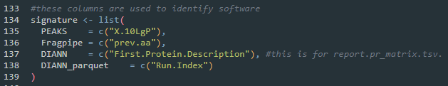

# EpitoScope
Shiny App for visualization of immunopeptidomics data

## WIP
Task List
- [X] Create Error Handler
- [X] Implement netMHCpan calling using WSL on windows
- [X] Allow Custom Schema
- [X] Combine the unique and lookup table, to one unified table
- [ ] Accept an anotation table to better differentiate measurements into biological/technical replicate and condition. This allows fine tuned handling of conditions within the same input data.
- [X] Overhaul the HTML report and update the report generation function.
- [ ] Make Sequence motif (stretches too much for only 1 sample) and measurement specific heatmap plots format better.
- [ ] clearly separate, and if needed add option, between peptide and peptidoform plots.
- [ ] Solve the automatic ordering of categorical data by ggplot.
- [ ] Prevent filtering criteria reset when selecting/deselecting samples. Likewise the groups for the grouped analysis.
- [ ] Change all functions to pkg::fun() style (i.e. dplyr::mutate()). This avoids future function masking.
- [ ] Decouple data calculations and plotting function, so that when changing window size only the plotting function is rerun and not the whole calculation
- [ ] Have a better way to separate PROTEIN names for different input formats.
- [ ] How to do NA handling for PCA plot. Sometimes user-input data is biologically too different for imputation.
- [ ] Unify PTM nomenclature between output. Translate mass difference to PTM.
- [ ] Limit HLA allele for binding prediction, so the plots and stats only incorporate relevant HLA and not everything.
- [ ] Add more plots to binding prediction to better mimic MhcVizPip
- [ ] Decide on how to download the binding Data.
- [ ] GO-term more transparency on protein names used
- [ ] Solve the usage of Peptide and Peptidoform usage in group analysis
- [ ] STRING allow background 
- [ ] Convert to Package

### Maybe?
- [ ] Flexible Length Range Percentage plot for MHC2 and perhaps other species
- [ ] Call GibbsCluster or HLA-HD from WSL
- [ ] 

## Features
- Interactive visualization of immunopeptidomics datasets.
- Support for:
  - PEAKS X Pro peptide.csv
  - PEAKS 12 Studio psm.csv
  - PEAKS 12 Online psm.csv
  - PEAKS 13 Studio psm.csv
  - FragPipe psm.tsv
  - FragPipe peptide.tsv
  - FragPipe combined_peptide.tsv
  - FragPipe combined_(modified)_peptide.tsv
- Customizable plots and tables.

## Installation
The following 3 scripts are mandatory to run the shiny App:
- Shiny.R
- global.R
- ui.R
- (report.Rmd for creating a report currently doesnt work)

Download the 3 scripts manually to the same folder or clone the repository using Git. For this, ensure Git is installed on your system. If not, download and install it from [Git's official website](https://git-scm.com/). Then, run the following command in your terminal:

```bash
git clone https://github.com/your-repo/EpitoScope.git
```

This will download all necessary files into a folder named `EpitoScope`.

### WSL and netMHCpan
Since netMHCpan only runs on linux, we need to install WSL (Windows Subsystem for Linux) on windows systems.
Then we install netMHCpan on the WSL.

#### Installing WSL on Windows
1. Open PowerShell as Administrator. You can search it in the windows search bar.
2. Install WSL by running:
  ```powershell
  wsl --install
  ```
3. Restart your computer to apply the changes.
4. You will need to set up an account. For more details, refer to the [official WSL documentation](https://learn.microsoft.com/en-us/windows/wsl/install).

#### Installing netMHCpan on WSL
1. Open your WSL terminal.
    1. open either CMD or PowerShell. (can be found through the search bar)
    2.  run WSL by typing:
        ```powershell
        wsl
        ```
2. Download the netMHCpan package from the [official website](https://services.healthtech.dtu.dk/service.php?NetMHCpan-4.2).
3. **[Optional]** Move the file to a different directory (i.e. Home directory). You can access the Windows folder locations through the `mnt` directory.
    1. for example to access the windows download folder its typically under the path: `/mnt/c/Users/USERNAME/Downloads/`
    2. to copy the .gz file from the Windows download directory to the WSL root directory do:
        ```bash
        cp /mnt/c/Users/USERNAME/Downloads/netMHCpan-4.2.tar.gz ~
        ```
       Here `~` is the path the file is copied to. Replace this with the directory of your choice. Tilda symbol always means root directory of WSL.
    3. Move to the directory where you copied the netMHCpan .gz file to.
        ```bash
        cd ~
        ```
4. Extract the file:
  ```bash
  tar -xvf netMHCpan-4.2.tar.gz
  ```
5. Navigate to the extracted directory:
  ```bash
  cd netMHCpan-4.2
  ```
6. **[WIP - Skip this step, since R environemnt doesnt read .bashrc]** Add the netMHCpan directory to your PATH by editing the `.bashrc` file:
  ```bash
  echo 'export PATH=$PATH:/path/to/netMHCpan-4.1' >> ~/.bashrc
  source ~/.bashrc
  ```
7. Test the installation by running:
  ```bash
  netMHCpan -h
  ```
8. If everything works, copy the absolute path where the netMHCpan is installed. You can get the path using:
  ```bash
  pwd
  ```
9. Set the `netmcpan_path` in the Shiny.R script to the path you just copied:


## Usage
1. Open Shiny.R with Rstudio
2. install missing dependencies (automatic popup in Rstudio).
3. Some remaining dependencies have to be installed via BiocManager:
```R
BiocManager::install("clusterProfiler")
BiocManager::install("org.Hs.eg.db")
```
4. Load your data as namend list into the variable (see data_loading.R for more details.):
```R
preloaded_data
```
5. In Shiny.R the "Run" button will be replaced by the "Run App" button. Click it and the app will start in a separate window.


### Adding custom schema
At the top of global.R, some preset schema are defined for common MS software output formats:


Futhermore, Just below the `column_schema` variable is the `signature` variable, which is used to automatically detect the input data format based on a unique column specific to that software output:



**The App generates a "generic" schema which is the collection of all schemes and is used if no signature can be assigned to the input data.**

These two can be updated manually, but a custom format can also be assigned on-the-go as part of a variable. For the custom `column_schema` the minimum requirement is either "PEPTIDE" or "STRIPPED" column. Missing column will be filled with empty data if not deriveable. A custom `signature` is optional, but is helpful to identify the data format to assign the schema. Multiple custom schema can be included:


If for some reason, the signature or schema might clash with the default data, one can opt to replace the default schema with the custom schema by setting `replace_schema = TRUE`. Both the custom schema/signature and the replace schema are found at the end of the Shiny.R script:


(An interesting trick is that if one want to apply the generic schema on all input data, then one can create an empty `custom_signature` and use `replace_schema = TRUE`, so that there are no signatures that can be used to identify the input data.)