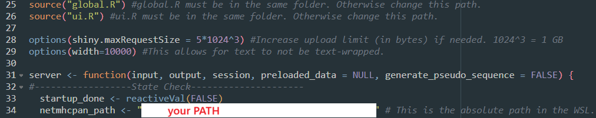

# EpitoScope
Shiny App for visualization of immunopeptidomics data

## Features
- Interactive visualization of immunopeptidomics datasets.
- Support for:
  - PEAKS X Pro peptide.csv
  - PEAKS 12 Studio psm.csv
  - PEAKS 12 Online psm.csv
  - PEAKS 13 Studio psm.csv
  - FragPipe psm.tsv
  - FragPipe peptide.tsv
  - FragPipe combined_peptide.tsv
  - FragPipe combined_(modified)_peptide.tsv
- Customizable plots and tables.

## Installation
The following 3 scripts are mandatory to run the shiny App:
- Shiny.R
- global.R
- ui.R
- (report.Rmd for creating a report currently doesnt work)

Download the 3 scripts manually to the same folder or clone the repository using Git. For this, ensure Git is installed on your system. If not, download and install it from [Git's official website](https://git-scm.com/). Then, run the following command in your terminal:

```bash
git clone https://github.com/your-repo/EpitoScope.git
```

This will download all necessary files into a folder named `EpitoScope`.

### WSL and netMHCpan
Since netMHCpan only runs on linux, we need to install WSL (Windows Subsystem for Linux) on windows systems.
Then we install netMHCpan on the WSL.

#### Installing WSL on Windows
1. Open PowerShell as Administrator. You can search it in the windows search bar.
2. Install WSL by running:
  ```powershell
  wsl --install
  ```
3. Restart your computer to apply the changes.
4. You will need to set up an account. For more details, refer to the [official WSL documentation](https://learn.microsoft.com/en-us/windows/wsl/install).

#### Installing netMHCpan on WSL
1. Open your WSL terminal.
    1. open either CMD or PowerShell. (can be found through the search bar)
    2.  run WSL by typing:
        ```powershell
        wsl
        ```
2. Download the netMHCpan package from the [official website](https://services.healthtech.dtu.dk/service.php?NetMHCpan-4.2).
3. **[Optional]** Move the file to a different directory (i.e. Home directory). You can access the Windows folder locations through the `mnt` directory.
    1. for example to access the windows download folder its typically under the path: `/mnt/c/Users/USERNAME/Downloads/`
    2. to copy the .gz file from the Windows download directory to the WSL root directory do:
        ```bash
        cp /mnt/c/Users/USERNAME/Downloads/netMHCpan-4.2.tar.gz ~
        ```
       Here `~` is the path the file is copied to. Replace this with the directory of your choice. Tilda symbol always means root directory of WSL.
    3. Move to the directory where you copied the netMHCpan .gz file to.
        ```bash
        cd ~
        ```
4. Extract the file:
  ```bash
  tar -xvf netMHCpan-4.2.tar.gz
  ```
5. Navigate to the extracted directory:
  ```bash
  cd netMHCpan-4.2
  ```
6. **[WIP - Skip this step, since R environemnt doesnt read .bashrc]** Add the netMHCpan directory to your PATH by editing the `.bashrc` file:
  ```bash
  echo 'export PATH=$PATH:/path/to/netMHCpan-4.1' >> ~/.bashrc
  source ~/.bashrc
  ```
7. Test the installation by running:
  ```bash
  netMHCpan -h
  ```
8. If everything works, copy the absolute path where the netMHCpan is installed. You can get the path using:
  ```bash
  pwd
  ```
9. Set the `netmcpan_path` in the Shiny.R script to the path you just copied:


## Usage
1. Open Shiny.R with Rstudio
2. install missing dependencies (automatic popup in Rstudio).
3. Some remaining dependencies have to be installed via BiocManager:
```R
BiocManager::install("clusterProfiler")
BiocManager::install("org.Hs.eg.db")
```
4. Load your data as namend list into the variable (see data_loading.R for more details.):
```R
preloaded_data
```
5. In Shiny.R the "Run" button will be replaced by the "Run App" button. Click it and the app will start in a separate window.

